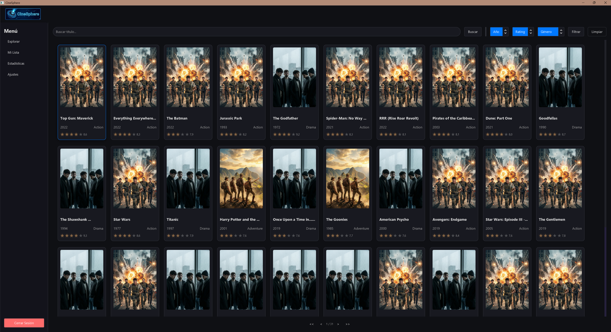

# CineSphere - Desktop App


**CineSphere** es una aplicación de escritorio moderna desarrollada en **Java** y **JavaFX** para la gestión integral de catálogos de cine. Permite a los usuarios explorar películas, gestionar su lista personal de "vistos/pendientes", consultar estadísticas detalladas y administrar la base de datos de contenido.

---

---

## Características Principales

*   **Gestión de Usuarios:** Sistema completo de Registro e Inicio de Sesión (Login) con roles de usuario (`USER`/`ADMIN`).
*   **Catálogo de Películas:** Visualización de películas con filtrado por género, año y calificación.
*   **Mi Lista Personal:** Gestión de estados de visualización (Pendiente, Viendo, Terminada, Abandonada) y puntuación personal.
*   **Estadísticas:** Gráficos visuales (PieChart/BarChart) sobre hábitos de consumo y géneros favoritos.
*   **Configuración Flexible:** Soporte dual para bases de datos (SQLite por defecto y PostgreSQL configurable).
*   **Importación de Datos:** Herramienta para importar películas masivamente desde archivos CSV.
*   **Interfaz Moderna:** Diseño cuidado con CSS personalizado ("Cine Dark Theme") y componentes visuales atractivos.

---

## Tecnologías Utilizadas

*   **Lenguaje:** Java (JDK 17 o superior)
*   **Interfaz Gráfica:** JavaFX (FXML + CSS)
*   **Gestión de Dependencias:** Maven
*   **Base de Datos:**
    *   SQLite (Portabilidad y desarrollo local)
    *   PostgreSQL (Entornos de producción)
    *   JDBC (Conectividad nativa)
*   **Patrones de Diseño:**
    *   MVC (Modelo-Vista-Controlador)
    *   DAO (Data Access Object) para la capa de persistencia
    *   Singleton (Para la conexión a BD y gestión de sesiones)

---

## Instalación y Ejecución

### Requisitos Previos

*   Java Development Kit (JDK) 17 o superior.
*   Maven instalado.
*   (Opcional) PostgreSQL si decides cambiar el motor de base de datos.

### Pasos para ejecutar

1.  **Clonar el repositorio:**
    ```bash
    git clone https://github.com/tu-usuario/cinesphere.git
    cd cinesphere
    ```

2.  **Configurar la Base de Datos:**
    *   Por defecto, la aplicación usa **SQLite**. El archivo de base de datos se generará automáticamente en `database/cinesphere.db`.
    *   Si deseas usar **PostgreSQL**, edita el archivo `src/main/resources/config/config-postgres.properties` con tus credenciales.

3.  **Compilar y Ejecutar:**
    ```bash
    mvn clean javafx:run
    ```

---

## Arquitectura del Proyecto

El proyecto sigue una estructura modular para facilitar el mantenimiento:

```
src/main/java/org/dam2/adp/cinesphere/
├── component/    # Controles UI personalizados (MovieCard, Chip, RatingDisplay)
├── controller/   # Controladores de JavaFX (Lógica de vistas)
├── DAO/          # Objetos de Acceso a Datos (Consultas SQL)
├── database/     # Configuración de Conexión y Esquema (DatabaseSchema)
├── model/        # POJOs / Entidades (Pelicula, Usuario, MiLista)
├── util/         # Utilidades (Sesión, Navegación, Logs, CSV)
└── Main.java     # Punto de entrada de la aplicación
```

---

## Configuración

La aplicación permite cambiar el modo de persistencia editando la clase `Conexion.java` o los archivos de propiedades en `src/main/resources/config/`.

*   **SQLite:** Ideal para pruebas rápidas y uso local (sin instalación de servidor).
*   **PostgreSQL:** Recomendado para entornos multi-usuario o producción.

---

## Contribución

¡Las contribuciones son bienvenidas! Si quieres mejorar CineSphere, sigue estos pasos:

1.  Haz un **Fork** del proyecto.
2.  Crea una nueva rama para tu funcionalidad (`git checkout -b feature/NuevaFuncionalidad`).
3.  Realiza tus cambios y haz **Commit** (`git commit -m 'Añade nueva funcionalidad'`).
4.  Sube tus cambios a tu fork (`git push origin feature/NuevaFuncionalidad`).
5.  Abre un **Pull Request**.
